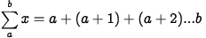
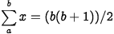
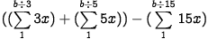
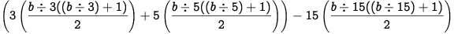

# PROBLEM 1

``````
If we list all the natural numbers below 10 that are multiples of 3 or 5, we get 3, 5, 6 and 9. The sum of these multiples is 23.

Find the sum of all the multiples of 3 or 5 below 1000.
``````

This problem is essentially an application of sumation, one of the basic tools in Calculous, i.e. :




'a' and 'b' are the lower and upper bouds, respectively.


One simple solution is to just create a function that keeps a running sum and several other variables; one to track what we can call the "solution sum," the others will be to keep track of the multiples of 3 and 5. Using a loop we can compute the multiples of 3 and 5, and then simply add them to the solution sum. We would have to create a condition that would ensure common multiples aren't counted twice This course a few problems, one of wich being of completely mediocre time and space complexity. Moreover, it's not very clever!

Instead we can use a trick invented by Euler himself when he was just a student. He came up with this formula for finding sums :




There is the small restriction that a needs to be 1, but that's fine for our purposes here.

So we'll need to modify it to give us the sum of multiples of 3 and 5, and we still have the issue of common multiples of 3 and 5. However this is a fairly basic computation and it lends itself to rather simple generalization. What we need is to do an integer division of 'b' by x, where x will be a constant (for our purposes the constants we need are 3 and 5). Next we can add our sums for 3 and 5, and subtract the sums for 15 (b div 15). Easy peasy!

In the end, the formula we need looks like this : 



which when use Euler's trick, we can turn this into something easily computable, and more importantly, gerneralizable. Long story short, here's our equation : 



Looks kinda gross, but if you consider that this will be computed by a script it's easy to see that this is a really elegant solution! Instead of interating through each value of x, we can just do one computation and get our answer. To generalize this equation, we can replace the constants with other integers.

#### NOTE

This works for integers!! 

## ALGORITHM


### EP001
``````
int x = 3; 
int y = 5; 

int b = 999;

int solution = (x(((b / x)((b / x) + 1))/2) + y(((b / y)((b / y) + 1))/2)) - xy(((b / xy)((b / xy) + 1))/2);
``````
### Generalized
``````
int x = C1; 
int y = C2; 

int b = UPP_BOUND;

int solution = (x(((b / x)((b / x) + 1))/2) + y(((b / y)((b / y) + 1))/2)) - xy(((b / xy)((b / xy) + 1))/2);
``````
## SOLUTION
``````
233168
``````
